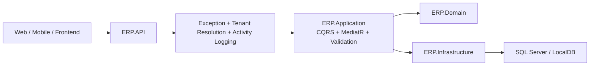

# ERPv2

ERPv2, kucuk ve orta olcekli perakende/satis yapan isletmeler icin gelistirilen, abonelik tabanli ve cok kiracili (`multi-tenant`) bir ERP Web API projesidir.

Proje; `.NET 10`, `ASP.NET Core Web API`, `Clean Architecture`, `MediatR`, `CQRS`, `EF Core Code First`, `JWT`, `Swagger/OpenAPI` ve `soft delete` prensipleri ile gelistirilmektedir.

Bu repo su anda sadece tek bir firma icin degil, platform uzerinden kayit olan birden fazla musteriye hizmet verebilecek bir SaaS ERP altyapisi sunar.

## Icindekiler

- [Genel Bakis](#genel-bakis)
- [Neler Yapabilir](#neler-yapabilir)
- [Mimari](#mimari)
- [Coklu Musteri Modeli](#coklu-musteri-modeli)
- [Rol ve Abonelik Modeli](#rol-ve-abonelik-modeli)
- [Moduller](#moduller)
- [API Konvansiyonlari](#api-konvansiyonlari)
- [Hizli Baslangic](#hizli-baslangic)
- [Development Seed Verileri](#development-seed-verileri)
- [Tenant Header Kullanimi](#tenant-header-kullanimi)
- [Ornek Akislar](#ornek-akislar)
- [OpenAPI ve Swagger](#openapi-ve-swagger)
- [Veritabani ve Migration](#veritabani-ve-migration)
- [Proje Yapisi](#proje-yapisi)
- [Mevcut Durum ve Siradaki Adimlar](#mevcut-durum-ve-siradaki-adimlar)

## Genel Bakis

Bu API su problemleri cozmeyi hedefler:

- Birden fazla isletmenin ayni platformu kullanabilmesi
- Her isletmenin verisinin digerlerinden tamamen ayri tutulmasi
- Cari, stok, siparis, fatura, muhasebe ve raporlama akisinin tek API altinda birlesmesi
- Kademeli abonelik sistemi ile ozellik bazli erisim saglanmasi
- Platform admin tarafinda musterileri, planlari, landing page iceriklerini ve audit loglari yonetebilme

Kisaca:

- `Platform Admin` sistemi yonetir
- `Tenant/Subscribers` sisteme abone olan isletmelerdir
- Her tenant kendi kullanicilari ve kendi verileri ile calisir
- Her silme islemi `soft delete` mantigi ile yapilir
- Her HTTP istegi audit log olarak izlenir

## Neler Yapabilir

Bu API su anda asagidaki ana yeteneklere sahiptir:

- Abonelikli SaaS kaydi
- Tek platform admin modeli
- Tenant bazli veri izolasyonu
- JWT tabanli auth altyapisi
- 3 kademeli rol/abonelik modeli
- Sirket, sube, depo ve urun yonetimi
- Cari hesap yonetimi
- Tedarikci ve alici listelerinin ayri tutulmasi
- Cari bazli veresiye/debt item takibi
- Excel ile toplu cari/debt item import
- Dinamik arama ve `suggest` endpointleri
- Satin alma ve satis siparisi yonetimi
- Siparisten fatura uretimi
- Stok hareketleri ve depolar arasi transfer
- Barkod okutma ve hizli satis (`POS quick sales`)
- Finans hareketleri
- Muhasebe hesap plani, yevmiye, kasa ve banka islemleri
- Tahsilat/odeme akislari
- Finansal raporlar ve temel karlilik raporlari
- Platform admin dashboard, revenue analytics ve audit log goruntuleme
- Landing page/public content yonetimi

## Mimari

Proje `Clean Architecture` mantigina gore 4 ana katmana ayrilmistir:

- `ERP.Domain`: cekirdek varliklar, enumlar, sabitler
- `ERP.Application`: CQRS, MediatR handler'lari, validator'lar, abstraction'lar
- `ERP.Infrastructure`: EF Core, repository'ler, JWT, password hashing, Excel import, persistence
- `ERP.API`: controller'lar, middleware'ler, Swagger, runtime configuration



### Teknik tercihlerin ozeti

- Framework: `.NET 10`
- API stili: `Controller-based ASP.NET Core Web API`
- Veri erisimi: `Entity Framework Core 10 + SQL Server`
- Dokumantasyon: `Swagger / OpenAPI`
- Guvenlik: `JWT Bearer`
- Validation: `FluentValidation`
- Excel import: `ClosedXML`
- Silme stratejisi: `Soft Delete`
- Hata yonetimi: `Global Exception Handling + ProblemDetails`

## Coklu Musteri Modeli

Bu proje gercek anlamda `multi-tenant` calisir.

Her isletme bir `TenantAccount` kaydi olarak tutulur. Is verisi tasiyan tablolar tenant'a baglidir. Ornek:

- `Products`
- `CariAccounts`
- `CariDebtItems`
- `SalesOrders`
- `PurchaseOrders`
- `Invoices`
- `StockMovements`
- `FinanceMovements`
- `ChartOfAccounts`
- `CashAccounts`
- `BankAccounts`
- `JournalEntries`

Tenant izolasyonu su sekilde saglanir:

- `DbContext` seviyesinde global tenant filtreleri uygulanir
- Platform admin disindaki isteklerde sorgular sadece aktif tenant verisini gorur
- Cross-tenant veri yazma ve guncelleme engellenir
- HTTP istegindeki tenant bilgisi middleware ile cozulur

Tenant cozumleme sirasi:

1. JWT claim: `tenant_id`
2. Header: `X-Tenant-Id`
3. Header: `X-Tenant-Code`
4. Sadece development modunda fallback tenant

Development ortaminda `X-Tenant-Code` gondermezseniz varsayilan tenant `dev-retail` olarak cozulur.

## Rol ve Abonelik Modeli

Sistemde su an 4 rol vardir:

- `Admin`: yalnizca platform admin
- `1.Kademe`
- `2.Kademe`
- `3.Kademe`

Tenant kullanicilari icin eski `Employee` modeli kaldirilmistir. Tenant kullanicisinin rolu, bagli oldugu abonelik planindan turetilir.

### Abonelik planlari

| Plan Enum | Gosterim | Atanan Rol | Varsayilan Fiyat | Max User | Varsayilan Ozellikler |
| --- | --- | --- | ---: | ---: | --- |
| `Starter` | `1. Kademe` | `1.Kademe` | `499` | `3` | `core`, `reports` |
| `Growth` | `2. Kademe` | `2.Kademe` | `1499` | `10` | `core`, `reports`, `pos`, `excel-import` |
| `Enterprise` | `3. Kademe` | `3.Kademe` | `3999` | `50` | `core`, `reports`, `pos`, `excel-import`, `invoices`, `advanced-reports` |

### Onemli not

- Public kayit akisi (`register-saas`) secilen plana gore tenant ve rol atar
- Platform admin tenant'a bagli degildir
- Auth/RBAC altyapisi hazirdir, ancak development testini kolaylastirmak icin `Security:EnforceAuthorization=false` ile pasif calistirilabilir

## Moduller

Asagidaki tablo API yuzeyinin yuksek seviyeli ozetidir.

| Route Prefix | Modulu | Ne Yapar |
| --- | --- | --- |
| `/api/auth` | Auth ve abonelik | login, refresh, logout, normal register, SaaS register, subscription plans, current user |
| `/api/platform-admin` | Platform yonetimi | dashboard, audit logs, subscriber listesi, plan yonetimi, landing content, revenue analytics |
| `/api/platform-admin/announcements` | Platform duyuru yonetimi | duyuru CRUD, publish/unpublish |
| `/api/announcements` | Kullanici duyurulari | yayindaki duyurulari tum kullanicilar icin listeler |
| `/api/public` | Public icerik | landing page iceriklerini public olarak sunar |
| `/api/companies` | Sirketler | CRUD |
| `/api/branches` | Subeler | CRUD |
| `/api/warehouses` | Depolar | CRUD |
| `/api/products` | Urunler | CRUD, suggestion arama, toplu fiyat guncelleme, toplu stok guncelleme |
| `/api/stock-movements` | Stok hareketleri | CRUD, transfer, kritik stok, bakiye gorunumu |
| `/api/cari-accounts` | Cari hesaplar | CRUD, supplier/buyer listeleri, details, suggest, debt item CRUD, Excel import |
| `/api/sales-orders` | Satis siparisleri | CRUD, approve |
| `/api/purchase-orders` | Satin alma siparisleri | CRUD, approve |
| `/api/invoices` | Faturalar | CRUD, item listesi, summary, siparisten fatura, send, cancel, pdf/xml |
| `/api/finance-movements` | Finans hareketleri | CRUD |
| `/api/accounting` | Muhasebe | hesap plani, yevmiye, kasa, banka, tahsilat/odeme, mutabakat eslestirme altyapisi |
| `/api/reports` | Raporlama | stok, satis, satin alma, cari, gelir/gider, nakit akisi, vade listesi, karlilik |
| `/api/pos` | POS | barkod scan, hizli satis |

### 1. Auth ve SaaS onboarding

Temel endpointler:

- `POST /api/auth/bootstrap-admin`
- `POST /api/auth/register`
- `POST /api/auth/register-saas`
- `POST /api/auth/login`
- `POST /api/auth/refresh`
- `GET /api/auth/me`
- `POST /api/auth/logout`
- `GET /api/auth/subscription-plans`

Bu grup su amaclara hizmet eder:

- Ilk platform admin kullanicisini olusturma
- Tenant disi basit kullanici kaydi
- Abonelik secerek yeni tenant kaydi acma
- JWT access token ve refresh token yonetimi
- Oturumdaki kullanici ve tenant bilgisini donme

### 2. Platform admin modulu

Temel endpointler:

- `GET /api/platform-admin/dashboard/overview`
- `GET /api/platform-admin/audit-logs`
- `GET /api/platform-admin/audit-logs/summary`
- `GET /api/platform-admin/subscribers`
- `GET /api/platform-admin/subscribers/{tenantId}`
- `PUT /api/platform-admin/subscribers/{tenantId}/subscription`
- `GET /api/platform-admin/plans`
- `PUT /api/platform-admin/plans/{plan}`
- `GET /api/platform-admin/landing-content`
- `PUT /api/platform-admin/landing-content/{key}`
- `GET /api/platform-admin/announcements`
- `POST /api/platform-admin/announcements`
- `PUT /api/platform-admin/announcements/{id}`
- `POST /api/platform-admin/announcements/{id}/publish`
- `POST /api/platform-admin/announcements/{id}/unpublish`
- `GET /api/platform-admin/analytics/revenue`

Bu grup ile:

- Tum aboneleri gorebilirsiniz
- Bir tenant'in planini ve subscription durumunu degistirebilirsiniz
- Audit loglari sorgulayabilirsiniz
- Landing page metinlerini panelden yonetebilirsiniz
- Duyuru metinlerini panelden yayinlayip pasife alabilirsiniz
- Toplam abone geliri ve plan bazli revenue analizini gorebilirsiniz

### 3. Master data modulleri

`companies`, `branches`, `warehouses`, `products` ve bunlarin iliskili stok yapilari tenant bazinda tutulur.

Yetenekler:

- CRUD islemleri
- Urun suggestion endpointi ile dinamik arama
- Stok hareketleri ve stok bakiyesi
- Depolar arasi transfer
- Kritik stok uyarilari

### 4. Cari modulu

Cari modulu bu projede iki ana gruba ayrilir:

- `Suppliers`: bizim borclu oldugumuz tedarikciler
- `Buyers`: bizden veresiye mal veya hizmet alan alicilar

Yetenekler:

- `GET /api/cari-accounts/suppliers`
- `GET /api/cari-accounts/buyers`
- `GET /api/cari-accounts/{id}/details`
- `GET /api/cari-accounts/{id}/debt-items`
- `POST /api/cari-accounts/{id}/debt-items`
- `PUT /api/cari-accounts/{id}/debt-items/{debtItemId}`
- `DELETE /api/cari-accounts/{id}/debt-items/{debtItemId}`
- `POST /api/cari-accounts/{id}/debt-items/import-excel`
- `POST /api/cari-accounts/buyers/import-excel` (coklu dosya; alici adini dosya isminden cozer)

Bu modulde mantik sunlardir:

- Cari hesaplar ust liste olarak tutulur
- Veresiye verilen satirlar `debt item` olarak ayri satirlarda saklanir
- Kullanici once cari listesini gorur
- Sonra secilen kisinin/sirketin detayina girerek o cariye ait urun/hareket satirlarini gorur

### 5. Excel import

Excel import ozellikle cari debt item importu icin optimize edilmistir.

Amac:

- Isletmeden gelen farkli formatlardaki veresiye dosyalarini sisteme alabilmek

Desteklenen davranislar:

- Bos satir ve bos kolon toleransi
- Nokta/virgul farkli ondalik ayraclari
- Farkli sayi formatlari
- Tarih kolonunda tarih disi aciklama/not olsa bile importu tamamen durdurmama
- Default kolon modeli ile hizli import
- Gerekirse kolon eslestirme mantigi ile daha dinamik import altyapisi

### 6. Siparis ve faturalama

Temel endpointler:

- `POST /api/sales-orders/{id}/approve`
- `POST /api/purchase-orders/{id}/approve`
- `POST /api/invoices/from-sales-order/{salesOrderId}`
- `POST /api/invoices/from-purchase-order/{purchaseOrderId}`
- `POST /api/invoices/{id}/send`
- `POST /api/invoices/{id}/cancel`
- `GET /api/invoices/{id}/pdf`
- `GET /api/invoices/{id}/xml`

Bu grup ile:

- Satin alma ve satis siparisi olusturulur
- Onayli siparisten fatura uretilir
- Fatura listeleme, ozet ve belge ciktilari alinabilir

### 7. POS ve hizli satis

Temel endpointler:

- `GET /api/pos/products/scan`
- `POST /api/pos/quick-sales`

Bu modulin amaci:

- Barkod okutulan urunu hizla bulmak
- Kasa/POS ekranindan hizli satis kaydi olusturmak

Bu API; is yerindeki fiziksel POS cihazlari, barkod okuyucular ve fis yazicilarla entegre olmaya uygun bir backend temelidir. Cihaza ozel entegrasyon ve yazdirma tarafinin bir kismi frontend/istemci veya cihaz adaptoru tarafinda tamamlanir.

### 8. Finans ve muhasebe

Temel endpoint gruplari:

- `chart-of-accounts`
- `journal-entries`
- `cash-accounts`
- `cash-transactions`
- `bank-accounts`
- `bank-transactions`
- `collections-payments`
- `finance-movements`

Yetenekler:

- Hesap plani yonetimi
- Yevmiye fisi olusturma, post etme, reverse etme
- Kasa hesaplari ve kasa hareketleri
- Banka hesaplari ve banka hareketleri
- Tahsilat/odeme kayitlari
- Finans hareketi ile banka/kasa hareketini iliskilendirme

### 9. Raporlama

Temel endpointler:

- `GET /api/reports/stock`
- `GET /api/reports/sales`
- `GET /api/reports/purchases`
- `GET /api/reports/cari-balances`
- `GET /api/reports/cari-aging`
- `GET /api/reports/income-expense`
- `GET /api/reports/finance/cash-flow-forecast`
- `GET /api/reports/finance/due-list`
- `GET /api/reports/finance/profitability/products`
- `GET /api/reports/finance/profitability/customers`
- `GET /api/reports/finance/profitability/branches`

Raporlar sayesinde:

- Stok ozeti
- Satis ve satin alma performansi
- Cari bakiye ve yaslandirma
- Gelir/gider gorunumu
- Nakit akis tahmini
- Vade listesi
- Urun/musteri/sube bazli karlilik

## API Konvansiyonlari

Bu API'de genel davranislar sunlardir:

- ID tipleri `Guid`
- Tarih/saat alanlari `UTC`
- Silme islemleri `soft delete`
- Hata cevaplari `ProblemDetails`
- Liste endpointlerinde cogu yerde `q`, `page`, `pageSize` benzeri query parametreleri bulunur
- Otomatik tamamlama icin `suggest` endpointleri kullanilir
- Import islemleri tipik olarak `multipart/form-data` bekler
- Swagger endpointleri aciklama notlari ile birlikte gelir

### Soft delete

Bir kaydi `DELETE` endpointi ile silmek, kaydi fiziksel olarak yok etmek yerine pasife alir. Bu sayede:

- veri butunlugu korunur
- audit takibi kolaylasir
- geri alinabilirlik icin altyapi korunur

### Audit log

Her request icin sistem aktivite kaydi tutulur. Admin paneli tarafinda:

- filtreli log listesi
- log detayi
- hata odakli ozet

goruntulenebilir.

## Hizli Baslangic

### Gereksinimler

- `.NET SDK 10`
- `SQL Server LocalDB` veya SQL Server erisimi
- Windows ortaminda LocalDB en kolay secenektir

### Projeyi calistirma

```bash
dotnet tool restore
dotnet restore
dotnet run --project src/ERP.API/ERP.API.csproj --launch-profile http
```

Varsayilan development adresleri:

- Swagger: [http://localhost:5058/swagger](http://localhost:5058/swagger)
- Health: [http://localhost:5058/health](http://localhost:5058/health)

Notlar:

- Development ortaminda migration'lar seed sirasinda uygulanir
- Uygulama kok path `/` istendiginde otomatik olarak `/swagger` sayfasina yonlendirir

## Development Seed Verileri

Development ortaminda proje ilk acildiginda ornek tenant ve kullanicilar olusturulur.

### Seed tenant'lar

| Tenant | Code | Plan | Rol Seviyesi |
| --- | --- | --- | --- |
| Dev Retail | `dev-retail` | `Enterprise` | `3.Kademe` |
| Dev Wholesale | `dev-wholesale` | `Growth` | `2.Kademe` |
| Dev Starter | `dev-starter` | `Starter` | `1.Kademe` |

### Seed kullanicilar

Tum kullanicilarin sifresi:

```text
Test123!
```

| UserName | Email | Rol | Tenant |
| --- | --- | --- | --- |
| `platform.admin` | `platform.admin@erp.local` | `Admin` | platform geneli |
| `test.admin` | `test.admin@erp.local` | `3.Kademe` | `dev-retail` |
| `test.employee` | `test.employee@erp.local` | `3.Kademe` | `dev-retail` |
| `test.admin.2` | `test.admin.2@erp.local` | `2.Kademe` | `dev-wholesale` |
| `test.employee.2` | `test.employee.2@erp.local` | `2.Kademe` | `dev-wholesale` |
| `test.employee.3` | `test.employee.3@erp.local` | `1.Kademe` | `dev-starter` |

Not:

- Bazi username'larda gecmisten kalan `employee` ifadesi vardir
- Ancak bu kullanicilar artik `Employee` rolunde degildir; yeni kademe modeli ile calisirlar

## Tenant Header Kullanimi

Auth pasifken veya tenant baglamini manual belirtmek istediginizde bu header'lar kullanilabilir:

```http
X-Tenant-Code: dev-retail
```

veya

```http
X-Tenant-Id: <tenant-guid>
```

Auth aktif oldugunda tenant claim'i token icinden de cozulebilir.

## Ornek Akislar

### 1. SaaS kaydi olusturma

```bash
curl -X POST "http://localhost:5058/api/auth/register-saas" \
  -H "Content-Type: application/json" \
  -d "{
    \"userName\": \"demo.owner\",
    \"email\": \"demo.owner@example.com\",
    \"password\": \"Test123!\",
    \"companyName\": \"Demo Market\",
    \"plan\": 2
  }"
```

Beklenen sonuc:

- yeni tenant olusur
- secilen plan atanir
- ilgili kademe rolu verilir
- access token ve refresh token doner

### 2. Login

```bash
curl -X POST "http://localhost:5058/api/auth/login" \
  -H "Content-Type: application/json" \
  -d "{
    \"userName\": \"test.admin\",
    \"password\": \"Test123!\"
  }"
```

### 3. Tenant bazli urun olusturma

```bash
curl -X POST "http://localhost:5058/api/products" \
  -H "Content-Type: application/json" \
  -H "X-Tenant-Code: dev-retail" \
  -d "{
    \"name\": \"Ornek Urun\",
    \"code\": \"URUN-001\",
    \"barcode\": \"8690000000001\",
    \"unit\": \"adet\",
    \"salePrice\": 125.50
  }"
```

### 4. Cari debt item Excel import

Endpoint:

```text
POST /api/cari-accounts/{cariAccountId}/debt-items/import-excel
```

Amac:

- secilen cari hesaba ait veresiye satirlarini Excel'den toplu olarak sisteme almak

## OpenAPI ve Swagger

Swagger/OpenAPI aktif gelmektedir.

- Runtime Swagger UI: [http://localhost:5058/swagger](http://localhost:5058/swagger)
- Repo icindeki OpenAPI export dosyasi: [API_OPENAPI_v1.json](./API_OPENAPI_v1.json)

Swagger ekraninda endpoint ozetleri ve kisa aciklamalar da gorulebilir.

Frontend veya entegrasyon ekipleri icin ek referans:

- [FRONTEND_API_ENDPOINT_REHBERI.md](./FRONTEND_API_ENDPOINT_REHBERI.md)

## Veritabani ve Migration

Varsayilan baglanti:

```text
Server=(localdb)\MSSQLLocalDB;Database=ERPv2Db;Trusted_Connection=True;TrustServerCertificate=True;MultipleActiveResultSets=true
```

### Migration calistirma

```bash
dotnet tool restore
dotnet ef database update --project src/ERP.Infrastructure --startup-project src/ERP.API
```

### Yeni migration ekleme

```bash
dotnet ef migrations add MigrationAdi --project src/ERP.Infrastructure --startup-project src/ERP.API --output-dir Persistence/Migrations
```

Onemli noktalar:

- Veri modeli `Code First` mantigiyla gelistirilir
- Development ortaminda uygulama acilisinda migration uygulanir
- Production benzeri ortamlarda migration'i explicit yonetmek daha dogrudur

## Proje Yapisi

```text
src/
  ERP.API/
    Controllers/
    Common/
    Contracts/
    Properties/
  ERP.Application/
    Abstractions/
    Features/
    Common/
  ERP.Domain/
    Common/
    Constants/
    Entities/
    Enums/
  ERP.Infrastructure/
    Authentication/
    Imports/
    Persistence/
    Security/
```

Repo icinde ayrica su dokumanlar bulunur:

- [API_OPENAPI_v1.json](./API_OPENAPI_v1.json): OpenAPI export
- [ERP_PROJE_YOL_HARITASI.md](./ERP_PROJE_YOL_HARITASI.md): hafiza dostu teknik yol haritasi
- [backend_agent_instructions.md](./backend_agent_instructions.md): frontend-backend servis esleme notlari

## Mevcut Durum ve Siradaki Adimlar

Bu proje aktif gelisim altindadir.

Tamamlanan ana alanlar:

- cekirdek mimari
- auth/jwt altyapisi
- multi-tenant veri izolasyonu
- cari modulu
- stok ve siparis altyapisi
- faturalama
- POS quick sale
- muhasebe temel modulleri
- audit log ve platform admin modulu

Henuz derinlestirilecek alanlar:

- cek/senet
- mahsup
- kur farki
- donem kapanisi
- cari/banka mutabakat akislari
- butce/hedef/sapma
- satis temsilcisi bazli performans
- daha genis otomatik test kapsami

## Ozet

ERPv2, tek bir isletmeye degil birden fazla aboneye hizmet verebilecek sekilde tasarlanmis, katmanli, genisletilebilir bir ERP API temelidir.

Bugun itibariyla su sorulara net cevap verebilir:

- Kullanici ve tenant kaydi yapabilir miyim
- Her musteri kendi verisiyle ayri calisabilir mi
- Cari, stok, siparis, fatura ve finans surecini tek API ile yonetebilir miyim
- Admin panelinden aboneleri, planlari ve loglari gorebilir miyim
- Swagger/OpenAPI ile frontend ve entegrasyon takimi hizli calisabilir mi

Cevap: evet.
